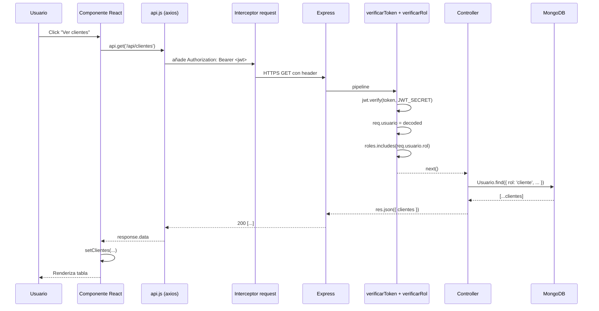
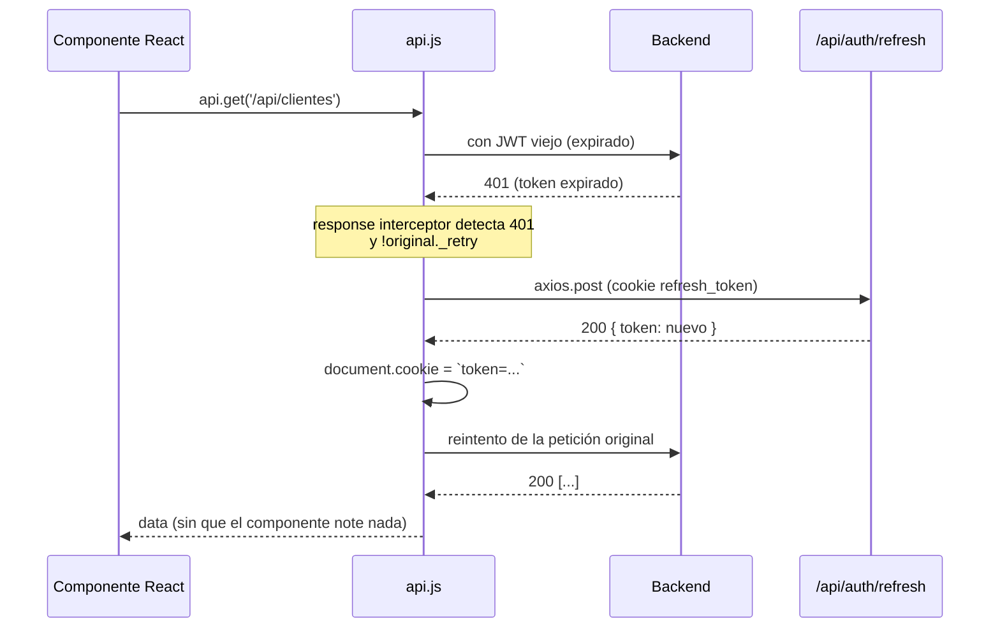

Una petición típica autenticada en GymSuite atraviesa cuatro capas: **componente React → axios interceptors → middlewares Express → controller → Mongoose → MongoDB**. Esta página documenta cada salto.

## Petición autenticada feliz (200)



## Petición con 401 y refresh automático



> ℹ️ **Por qué `axios.post` y no `api.post`**
>
> Si llamáramos a `/refresh` con la misma instancia `api`, su interceptor procesaría la respuesta y, si fallara, intentaría refrescar otra vez, causando recursión infinita. Usar `axios.post` nativo aísla la llamada.

## Capas en detalle

### 1. Componente React

Llama a `api.method(url, data?)` desde `services/api.js`. **No** maneja cookies ni headers — el interceptor lo hace.

### 2. Interceptor de request (`api.js`)

Lee cookie `token` de `document.cookie` (regex `/(?:^|;\s*)token=([^;]+)/`) y la inyecta como `Authorization: Bearer <token>`.

### 3. Interceptor de response (`api.js`)

Si `error.response.status === 401` y `!original._retry`: marca retry, llama a `/refresh`, sustituye token y reintenta. Si refresh falla: `onSesionExpirada` callback (= `limpiarSesion` de `AuthContext`).

### 4. Middlewares Express (`server/middleware/auth.js`)

Pipeline típico:

```
verificarToken → verificarRol('admin', 'entrenador') → controller
```

Detalle: [Backend → Auth flujo](../backend/auth-flujo.md).

### 5. Controller

Lógica de negocio. Lee `req.usuario` (inyectado por `verificarToken`). Llama al modelo Mongoose. Devuelve `res.json(...)`.

### 6. Mongoose ↔ MongoDB

Mongoose serializa el documento, envía al driver, MongoDB responde. **Comprobar resultado según el método**:

| Método | Devuelve | Comprobar con |
|--------|----------|---------------|
| `find` | Array | `resultado.length === 0` |
| `findById`, `findByIdAndUpdate`, `findByIdAndDelete` | Documento o `null` | `!resultado` |
| `save()` | Documento (lanza si falla) | No comprobar; usar try/catch |

Ver [Decisiones → Consultas Mongoose](./decisiones.md#consultas-mongoose).

## Errores en el camino

| Punto | Error típico | Síntoma en frontend |
|-------|--------------|---------------------|
| Cookie sin `token` | request sin header | 401 → refresh → si tampoco refresh, logout |
| `JWT_SECRET` distinto | `jwt.verify` falla | 401 persistente; verificar env vars |
| CORS mal | preflight 403 | error en consola del navegador |
| Mongoose no conectado | controller responde 500 | `/api/health` reporta `readyState !== 1` |

## Lecturas relacionadas

- [Visión general](./vision-general.md)
- [Backend → Auth flujo](../backend/auth-flujo.md) — diagramas detallados de login y refresh
- [Frontend → Arquitectura](../frontend/arquitectura.md) — interceptors
- [Decisiones (ADR)](./decisiones.md)
