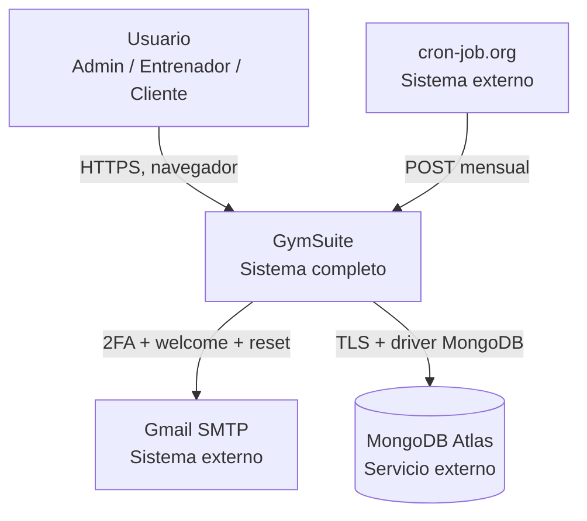
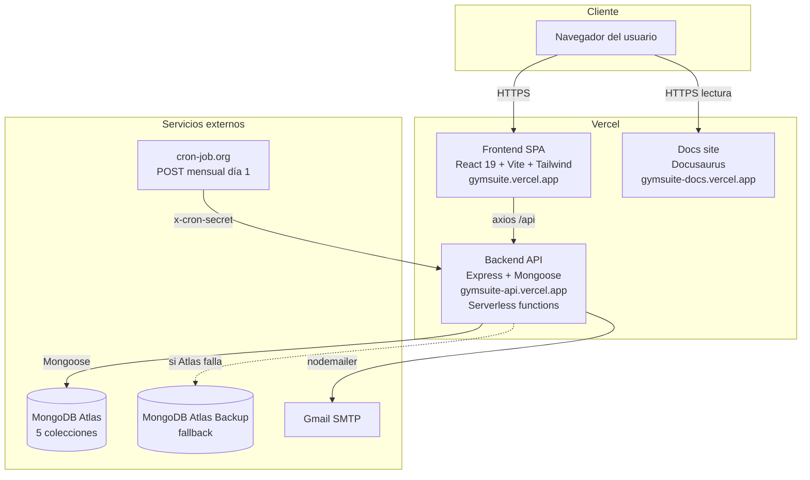

GymSuite sigue una arquitectura clásica **SPA + REST API + base de datos documental**, desplegada como dos proyectos serverless independientes en Vercel.

## C4 — Nivel 1 (contexto)

## C4 — Nivel 2 (contenedores)

## Responsabilidades por contenedor

| Contenedor | Responsabilidad | Lenguaje | Despliegue |
|------------|-----------------|----------|------------|
| Frontend SPA | UI, validación cliente, estado de sesión, formato de importes | React 19 | Vercel static + SPA rewrite |
| Backend API | Auth, autorización, lógica de negocio, persistencia, emails | Node 20 + Express | Vercel serverless function |
| Docs site | Documentación técnica | Docusaurus 3.10 | Vercel static |
| MongoDB Atlas | Persistencia documental | — | Atlas M0/M2 |
| Gmail SMTP | Email transaccional (2FA, alta, reset) | — | Externo |
| cron-job.org | Disparador mensual de generación de cuotas | — | Externo |

## Por qué dos proyectos Vercel separados

- **Despliegue independiente**: cambios en backend no rebuildean el frontend.
- **Escalado independiente**: la SPA es estática (CDN), el backend ejecuta en serverless por demanda.
- **Cookies cross-origin obligatorias**: ver [Seguridad → Cookies](../seguridad/cookies.md).

> ℹ️ **Trade-off conocido**
>
> Dos proyectos exigen `sameSite: 'none'` + `secure: true` en cookies de prod, y `withCredentials: true` en axios. Un solo proyecto unificado lo evitaría pero impediría builds independientes.

## Flujo de una petición típica

Ver [Flujo de datos](./flujo-datos.md) para el diagrama de secuencia completo.

## Restricciones del entorno serverless

- **Sin estado en memoria**: cada invocación es nueva, no hay caché compartida. OTPs van a Mongo (colección `otps` con índice TTL).
- **Sin `node-cron`**: cron-job.org dispara la generación mensual (ver [Cron de pagos](../operaciones/cron-pagos.md)).
- **Timeout 10 s** en plan gratuito: monitorizar `generarPagos` con muchos clientes.
- **IPs dinámicas**: Atlas debe permitir `0.0.0.0/0` o configurar Private Link.

## Lecturas relacionadas

- [Stack](./stack.md) — versiones exactas
- [Flujo de datos](./flujo-datos.md) — petición autenticada paso a paso
- [Modelo de roles](./modelo-roles.md) — matriz de permisos
- [Decisiones (ADR)](./decisiones.md) — por qué bcrypt 5.1.1, céntimos, ES modules, etc.
