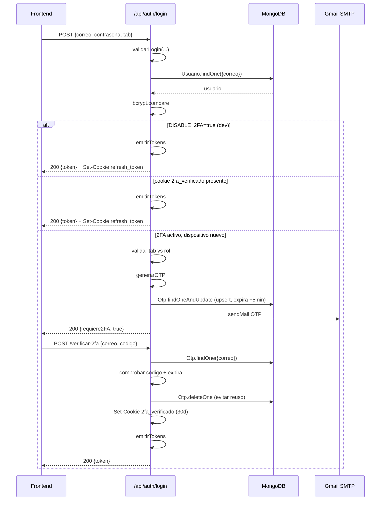
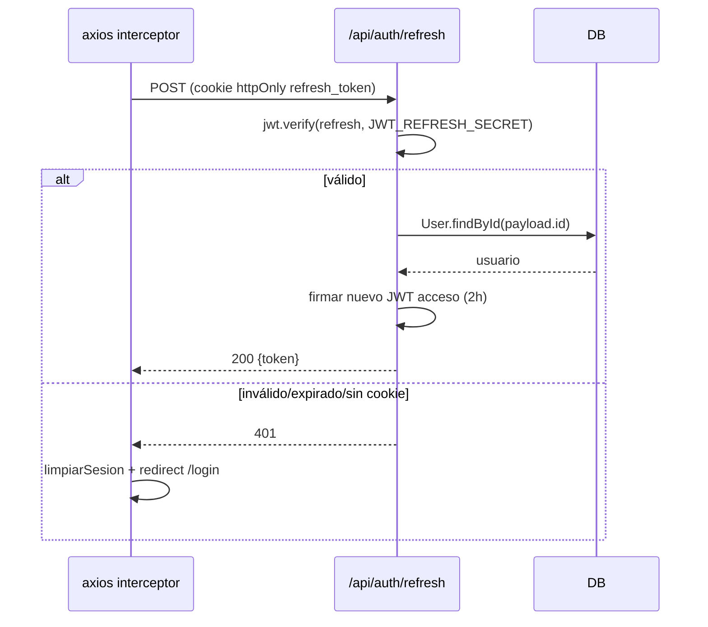
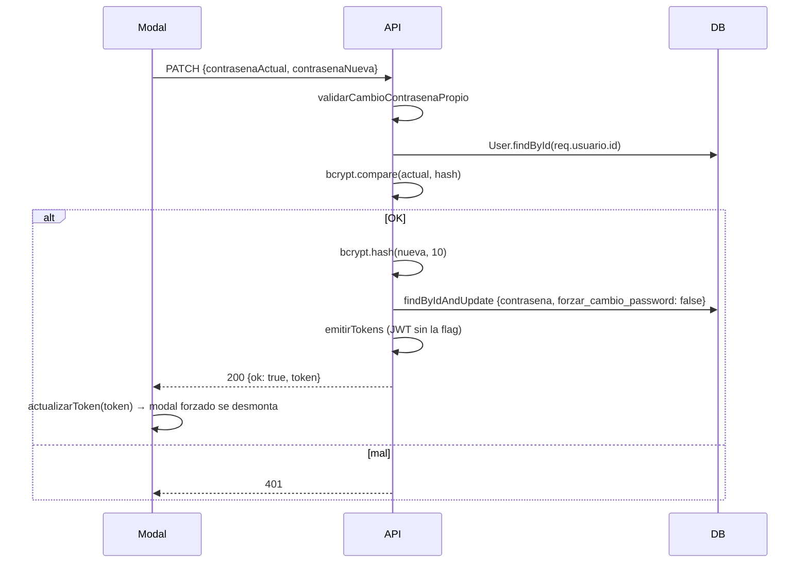
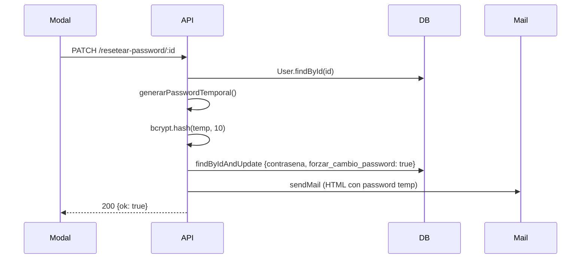

Sistema de auth completo: JWT acceso (2h) + refresh token (7d, httpOnly) + 2FA por email + cambio forzoso de contraseña.

Controller: `server/controllers/authController.js` — endpoints en [Endpoints → Auth](./endpoints/auth.md). Middlewares: `server/middleware/auth.js`.

## Helpers internos del controller

- `cookieOpciones` — `{ httpOnly, sameSite, secure, maxAge: 7 días }`. Cambia según `NODE_ENV`.
- `generarOTP()` — 6 dígitos con `crypto.randomInt(100000, 1000000)` (CSPRNG, no `Math.random`).
- `emitirTokens(usuario, res)` — firma JWT acceso (2h) con payload `{ id, rol, nombre, apellidos, forzar_cambio_password }` (`JWT_SECRET`), firma refresh (7d, payload `{ id }`) con `JWT_REFRESH_SECRET`, setea cookie `refresh_token`, devuelve el JWT acceso.

## 1. Login con 2FA por email



### Validación de pestaña

| Pestaña (`tab`) | Roles aceptados | 403 si no encaja |
|-----------------|-----------------|-------------------|
| `cliente` | `cliente` | "Esta cuenta no es de cliente. Usa la pestaña Trabajador." |
| `trabajador` | `admin`, `entrenador` | "Esta cuenta no es de trabajador. Usa la pestaña Cliente." |

## 2. Refresh

Renueva el JWT de acceso sin reloguear.



> ℹ️ **Refresh no rota**
>
> La cookie `refresh_token` sigue viva hasta su expiración natural. Si quisieras rotación, llamar a `emitirTokens` en lugar de firmar directo. Trade-off: más seguro vs más writes a la cookie.

## 3. Cambio de contraseña (propia)

`PATCH /api/auth/cambiar-contrasena`.



## 4. Reset por admin

`PATCH /api/auth/resetear-password/:id`. Solo admin.



El usuario afectado verá `ModalCambiarContrasena forzado` en su próximo login.

## 5. Logout

`POST /api/auth/logout`. Limpia cookie `refresh_token` con **mismas opciones** que al setearla (importante en prod: `sameSite: 'none', secure: true`).

```js
res.clearCookie('refresh_token', { httpOnly: true, sameSite, secure });
```

<a id="middlewares"></a>

## Middlewares

`server/middleware/auth.js`:

### `verificarToken(req, res, next)`

```
Extrae token de Authorization: Bearer
jwt.verify(token, JWT_SECRET)
req.usuario = decoded   // {id, rol, nombre, apellidos, forzar_cambio_password}
```

401 si falta o falla.

### `verificarRol(...roles)`

Factory. 403 si `req.usuario.rol` no en `roles`.

### `verificarPropioOAdmin(req, res, next)`

Admin pasa libre. Otro solo si `req.usuario.id === req.params.id`. Usado en `GET /api/entrenadores/:id`.

### `verificarRolBody(rolEsperado)`

Factory. Exige `req.body.rol === rolEsperado`. Evita crear admin vía `POST /api/entrenadores` y viceversa.

### `forzarRolQuery(rolEsperado)`

Factory. Sobrescribe `req.query.rol` antes del handler.

### `verificarCronSecret(req, res, next)`

Lee `req.headers['x-cron-secret']` y compara con `process.env.CRON_SECRET`. 401 si no coincide. **No requiere JWT** (cron-job.org no se autentica).

## Cambio forzoso de contraseña — Flujo completo

1. **Activación:** `crearCliente`, `crearEmpleado`, `resetearPassword` setean `forzar_cambio_password: true`. El JWT emitido lleva la flag.
2. **Detección:** `AuthContext` decodifica el JWT al cargar. `usuario.forzar_cambio_password === true`.
3. **Bloqueo de UI:** `App.jsx` monta `<ModalCambiarContrasena forzado />` por encima de toda la app. **No se puede cerrar** (`cerrable={false}` en `ModalBase`).
4. **Cambio:** `PATCH /api/auth/cambiar-contrasena`.
5. **Desactivación:** backend setea `forzar_cambio_password: false` y emite JWT nuevo sin la flag.
6. **Cierre:** `actualizarToken(data.token)` → el modal se desmonta automáticamente.

## Gotchas

- **Cookies cross-origin en prod:** `sameSite: 'none', secure: true` + `withCredentials: true` en axios. Si falla auth en prod, revisar primero CORS (`FRONTEND_URL`) y cookies en DevTools.
- **`verificar2FA` borra el OTP antes de devolver el token.** Si la respuesta falla en tránsito, el usuario tiene que repetir login (y se le manda nuevo OTP).
- **`cookieOpciones` del logout debe coincidir con la del login.** Si no, el navegador no borra la cookie en prod.
- **`validarLogin` no valida formato de contraseña.** Solo en login (para no bloquear usuarios con contraseñas antiguas).
