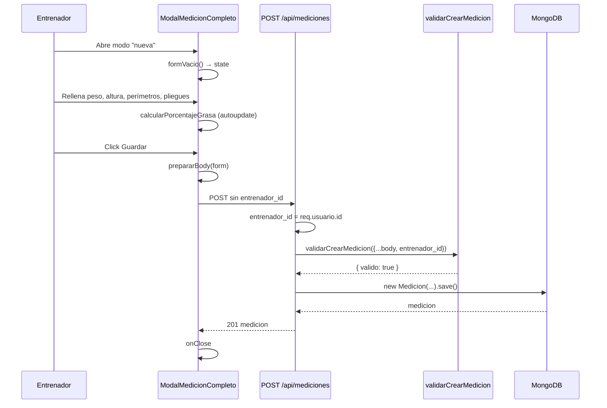

Helpers de cálculo (IMC, % grasa Durnin-Womersley) y validación de rangos. La parte backend (controller + validador) está en [Endpoints → Mediciones](./endpoints/mediciones.md). Los helpers son **del cliente** (en `client/src/utils/composicionCorporal.js`) — el backend no recalcula; almacena lo que llega validado.

## Estructura de una medición

Tres bloques numéricos:

| Bloque | Campos | Unidad |
|--------|--------|--------|
| Generales | `peso`, `altura`, `porcentaje_grasa` | kg, cm, % |
| Perímetros (10) | `cuello, hombros, pecho_ins, pecho_exp, cintura, cadera, muslo, gemelo, brazo, antebrazo` | cm |
| Pliegues (4) | `biceps, triceps, subescapular, cresta_iliaca` | mm |

Campos administrativos: `cliente_id`, `entrenador_id`, `fecha`, `observaciones`.

Todos los numéricos son **opcionales** — permite registros parciales.

## Validación

### Por campo

`validators/validarCampos.js` define `RANGOS_MEDICION` (interno, no exportado). Tabla completa: [Endpoints → Mediciones](./endpoints/mediciones.md#rangos-de-validación).

### Por operación

`validators/validarRegistros.js`:

| Validador | Reglas |
|-----------|--------|
| `validarCrearMedicion` | Obligatorios: `cliente_id`, `entrenador_id`, `fecha`. Opcionales validados: los 17 numéricos. Obs opcional, máx 500 chars |
| `validarEditarMedicion` | **Rechaza** `cliente_id` y `entrenador_id`. Resto opcional con mismas reglas |

## IMC

```js
calcularIMC(peso, altura) → Number | null
```

Fórmula clásica: `peso(kg) / altura(m)²`.

| Input | Output |
|-------|--------|
| `peso = 70, altura = 175` | `22.9` |
| `peso = 0` | `null` |
| `altura = 0` | `null` |
| `peso = null` | `null` |

Redondeo a 1 decimal.

## Porcentaje de grasa (Durnin-Womersley 1974)

```js
calcularPorcentajeGrasa(pliegues, sexo, fechaNacimiento) → Number | null
```

### Algoritmo

1. Validar `sexo ∈ {masculino, femenino}` (si no, `null`).
2. Sumar 4 pliegues: `biceps + triceps + subescapular + cresta_iliaca` (defaulteando a 0 los `null`/`undefined`).
3. Si suma ≤ 0: `null`.
4. Calcular edad desde `fechaNacimiento`; si no hay, asumir **30** años.
5. Buscar constantes `{ a, b }` en `CONSTANTES_DW[sexo]` por grupo de edad.
6. **Densidad**: `densidad = a - b * log10(suma)`.
7. **% grasa**: `(4.95 / densidad - 4.5) * 100`.
8. Acotar `[0, 100]`, redondear a 1 decimal.

### Grupos de edad (privados al módulo)

| Edad | Etiqueta |
|------|----------|
| ≤ 16 | adolescente |
| ≤ 19 | joven |
| ≤ 29 | adulto joven |
| ≤ 39 | adulto |
| ≤ 49 | adulto maduro |
| > 49 | mayor |

Constantes `a, b` específicas por sexo+grupo. Tabla original en el paper.

### Ejemplo numérico

Hombre 30 años, pliegues: bíceps 6, tríceps 12, subescapular 14, cresta 18 mm. Suma = 50.

- Constantes (hombre, 20–29): `a = 1.1631, b = 0.0632`.
- `densidad = 1.1631 - 0.0632 * log10(50) = 1.1631 - 0.1074 = 1.0557`.
- `% grasa = (4.95 / 1.0557 - 4.5) * 100 = 19.0 %`.

## Helpers del formulario (`client/src/utils/medicion.js`)

| Helper | Devuelve | Uso |
|--------|----------|-----|
| `PERIMETROS` | `[{ id, label }]` × 10 | Iterar inputs |
| `PLIEGUES` | `[{ id, label }]` × 4 | Iterar inputs |
| `CAMPOS_OBLIGATORIOS` | `string[]` | Marca visual en el form |
| `CAMPOS_NUMERICOS` | `Set<string>` | `prepararBody` convierte a `Number` |
| `hoy()` | `'YYYY-MM-DD'` | Default de `<input type="date">` |
| `prepararBody(datos)` | object | Filtra strings vacíos, convierte numéricos |
| `formVacio()` | object | Estado inicial del form vacío |
| `formDesdeMedicion(medicion)` | object | Estado inicial del form al editar |

## Flujo de creación



## Flujo de edición

1. `ModalMedicionesHistorial` → click lápiz → `ModalMedicionCompleto` modo editar.
2. `formDesdeMedicion(medicion)` inicializa form.
3. Editar campos → si cambian pliegues, recalcula `porcentaje_grasa`.
4. Guardar: `prepararBody(form)` → `PUT /api/mediciones/:id`. **No incluye** `cliente_id` ni `entrenador_id`.

## Patrón "adjust state during render"

`ModalMedicionCompleto` con `StepperFecha`: al navegar entre mediciones, el form se resetea **durante el render** (no en `useEffect`):

```js
const [medicionMostradaId, setMedicionMostradaId] = useState(medicionActual._id);
if (medicionActual._id !== medicionMostradaId) {
  setForm(formDesdeMedicion(medicionActual));
  setMedicionMostradaId(medicionActual._id);
}
```

Esto evita un render extra y `useEffect` con deps frágiles.

## Gotchas

- **`entrenador_id` del token, no del body.** El form nunca lo envía. Controller lo inyecta.
- **`validarEditarMedicion` rechaza `cliente_id` y `entrenador_id`.** El modal no los pasa al body al editar.
- **Pliegues → grasa.** Si alguno falta, `calcularPorcentajeGrasa` suma con `?? 0` pero exige `suma > 0`.
- **Sin `fechaNacimiento`.** Asume 30 años. Si el cliente tiene 70, el cálculo no será preciso — siempre rellenar `fecha_nacimiento`.
- **Recharts no entiende clases Tailwind.** En `ModalGraficaMediciones`, colores hex literal.
- **`fecha + 'T00:00:00'` para parsing local.** Sin esto, `'2026-05-13'` se interpreta UTC y muestra mal en zonas con offset.
