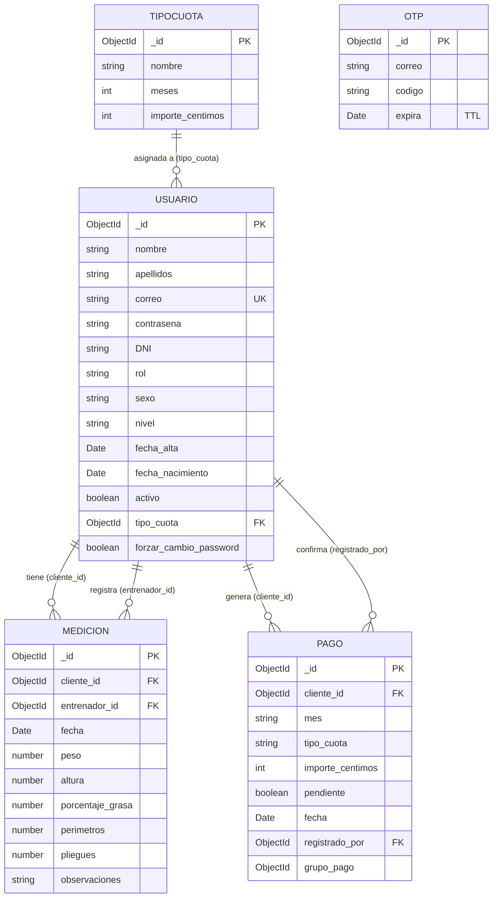

Schemas Mongoose en `server/models/`. Seis colecciones: `usuarios`, `mediciones`, `pagos`, `tipos_cuota`, `otps`, `reset_tokens`. Importes siempre en céntimos (enteros).

## Diagrama ER

## `usuarios`

Colección unificada para los tres roles (admin/entrenador/cliente). Diferenciados por el campo `rol`. Campos `nivel` y `tipo_cuota` solo aplican a clientes.

### Campos

| Campo | Tipo | Obligatorio | Default | Notas |
|-------|------|-------------|---------|-------|
| `_id` | ObjectId | auto | — | Generado por Mongo |
| `nombre` | String | sí | — | — |
| `apellidos` | String | sí | — | — |
| `correo` | String | sí | — | **Único globalmente**. `lowercase: true, trim: true` — Mongoose normaliza al guardar. |
| `contrasena` | String | sí | — | Hash bcrypt. **`select: false`** — excluida de queries por defecto. Incluir con `.select('+contrasena')` solo en login y cambiarContrasena |
| `telefono` | String | no | — | Mock prefijo `5` |
| `direccion` | String | no | — | — |
| `fecha_nacimiento` | Date | sí | — | Edad 16–120 |
| `DNI` | String | sí | — | **Único por rol**. Mock `% 19` |
| `rol` | String | sí | — | Enum: `admin` \| `entrenador` \| `cliente` |
| `sexo` | String | no | — | Enum: `masculino` \| `femenino` |
| `nivel` | String | no | — | Enum: principiante/intermedio/avanzado. **Solo clientes** |
| `fecha_alta` | Date | sí | `Date.now` | Reset al reactivar |
| `activo` | Boolean | sí | `true` | Bajas lógicas |
| `tipo_cuota` | ObjectId (`TipoCuota`) | no | — | **Solo clientes** |
| `forzar_cambio_password` | Boolean | no | `false` | Tras alta o reset |

### Índices

- `correo` único global (`unique: true`).
- `{ DNI: 1, rol: 1 }` único compuesto. Una persona puede tener cuenta como cliente y entrenador con el mismo DNI, pero no dos del mismo rol.

### Gotchas

- Al crear, generar contraseña con `generarPasswordTemporal()` y hashear con `bcrypt.hash(_, 10)`.
- `validarCrearCliente` y `validarCrearTrabajador` **no** validan `contrasena`.
- `contrasena` tiene `select: false`: no aparece en ninguna query salvo que se pida con `.select('+contrasena')`. Solo deben hacerlo `login` y `cambiarContrasena` en `authController.js`.
- Al editar, usar las whitelist `CAMPOS_EDITABLES_CLIENTE` / `CAMPOS_EDITABLES_EMPLEADO` — campos no listados (incluido `contrasena`) se ignoran.
- `darDeAlta` **resetea** `fecha_alta` a `new Date()` además de `activo: true`.

## `mediciones`

Registros antropométricos. Todos los campos numéricos opcionales (permite registros parciales).

### Campos

| Campo | Tipo | Obligatorio | Default | Unidad |
|-------|------|-------------|---------|--------|
| `_id` | ObjectId | auto | — | — |
| `cliente_id` | ObjectId (`Usuario`) | sí | — | — |
| `entrenador_id` | ObjectId (`Usuario`) | sí | — | **del JWT**, no del body |
| `fecha` | Date | sí | `Date.now` | — |
| `peso` | Number | no | — | kg |
| `altura` | Number | no | — | cm |
| `porcentaje_grasa` | Number | no | — | % |
| `cuello`, `hombros`, `pecho_ins`, `pecho_exp`, `cintura`, `cadera`, `muslo`, `gemelo`, `brazo`, `antebrazo` | Number | no | — | cm (perímetros) |
| `biceps`, `triceps`, `subescapular`, `cresta_iliaca` | Number | no | — | mm (pliegues) |
| `observaciones` | String | no | — | Máx 500 chars |

### Gotchas

### Índices

- `{ cliente_id: 1, fecha: -1 }` — cubre `find({ cliente_id }).sort({ fecha: -1 })` (historial de mediciones por cliente).

### Gotchas

- `entrenador_id` se asigna en el controller desde `req.usuario.id`.
- `validarEditarMedicion` **rechaza** `cliente_id` y `entrenador_id` en body.
- Los 4 pliegues se usan en `calcularPorcentajeGrasa` (Durnin-Womersley). Ver [Mediciones cálculo](./mediciones-calculo.md).

## `pagos`

Pagos mensuales de cuota. Generados con `pendiente=true`, sin `fecha` ni `registrado_por`; al confirmar el cobro se rellenan.

### Campos

| Campo | Tipo | Obligatorio | Default | Notas |
|-------|------|-------------|---------|-------|
| `_id` | ObjectId | auto | — | — |
| `cliente_id` | ObjectId (`Usuario`) | sí | — | — |
| `mes` | String | sí | — | Formato `YYYY-MM` |
| `tipo_cuota` | String | sí | — | **Nombre** (no ObjectId — ver [ADR-009](../arquitectura/decisiones.md#tipo-cuota-string)) |
| `importe` | Number (céntimos) | sí, `min: 0` | — | Entero |
| `pendiente` | Boolean | sí | `false` | Generados con `true` |
| `fecha` | Date | no | — | Al confirmar |
| `registrado_por` | ObjectId (`Usuario`) | no | — | Al confirmar |
| `grupo_pago` | ObjectId | no | — | Agrupa N meses de una misma cuota multimensual |

### Índices

- `{ cliente_id: 1, mes: -1 }` — historial de pagos por cliente.
- `{ grupo_pago: 1 }` — `updateMany`/`deleteMany` por grupo.
- `{ mes: 1, pendiente: 1 }` — stats mensuales y pagos pendientes.

### Gotchas

- **Importes en céntimos.** Nunca convertir a decimales en el modelo.
- `mes` es string ordenado lexicográficamente (`YYYY-MM` funciona).
- Al confirmar, **`updateMany({ grupo_pago })`** — no mes a mes.
- Al cambiar cuota, **`deleteMany({ cliente_id, pendiente: true })`** para regenerar.

## `tipos_cuota`

Catálogo de cuotas disponibles. Editable solo por admin.

### Campos

| Campo | Tipo | Obligatorio | Notas |
|-------|------|-------------|-------|
| `_id` | ObjectId | auto | — |
| `nombre` | String | sí | Único de hecho (no impuesto) |
| `meses` | Number | sí | Entero 1–24 |
| `importe` | Number (céntimos) | sí, `min: 0` | **Total**, no por mes |

### Gotchas

- Frontend usa euros con `step="0.01"` en inputs; convertir con `eurosACentimos` antes de mandar.
- `crearCuota` destructura `{ nombre, meses, importe }` explícitamente para rechazar campos extra.
- Al borrar, los pagos quedan con el nombre intacto (`tipo_cuota` es String en `Pago`).

## `reset_tokens`

Tokens de un solo uso para restablecer contraseña por link. Se crean al resetear y se eliminan al consumirse o caducar.

### Campos

| Campo | Tipo | Obligatorio | Notas |
|-------|------|-------------|-------|
| `usuario_id` | ObjectId | sí | Indexado. Referencia al usuario |
| `token` | String | sí | 64 hex chars (`crypto.randomBytes(32)`). Único |
| `expira` | Date | sí | **Índice TTL** (`expires: 0`). Vida: 30 min |

### Gotchas

- `findOneAndUpdate({ usuario_id }, ..., { upsert: true })` — solo un token activo por usuario.
- Se consume con `deleteOne({ token })` tras usarse. Segunda apertura del link → 400.
- `restablecerPassword` verifica `Date.now() > entrada.expira` aunque el TTL aún no haya barrido.

## `otps`

Códigos OTP del 2FA. Almacenados en Mongo (no memoria) para sobrevivir a cold starts serverless.

### Campos

| Campo | Tipo | Obligatorio | Notas |
|-------|------|-------------|-------|
| `_id` | ObjectId | auto | — |
| `correo` | String | sí | Indexado |
| `codigo` | String | sí | 6 dígitos con `crypto.randomInt(100000, 1000000)` |
| `expira` | Date | sí | **Índice TTL** (`expires: 0`) — Mongo borra automáticamente |
| `intentos` | Number (default `0`) | no | Contador de fallos; al alcanzar 5, `verificar2FA` borra el OTP y devuelve 429 |

### Gotchas

- `findOneAndUpdate({ correo }, ..., { upsert: true })` sobrescribe OTP previo. El contador `intentos` vuelve a `0` con el nuevo documento.
- Tras verificar, `deleteOne({ correo })` para evitar reuso.
- Cada código incorrecto: `Otp.updateOne({ correo }, { $inc: { intentos: 1 } })`.
- TTL puede tardar segundos; `verificar2FA` también compara `Date.now() > entrada.expira.getTime()` por seguridad.
- Ventana de validez: **5 minutos** (`expira = Date.now() + 5*60*1000`).
