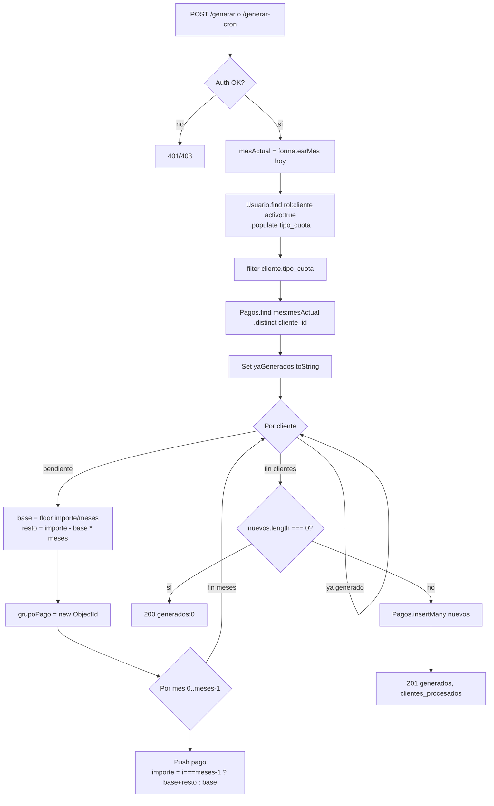
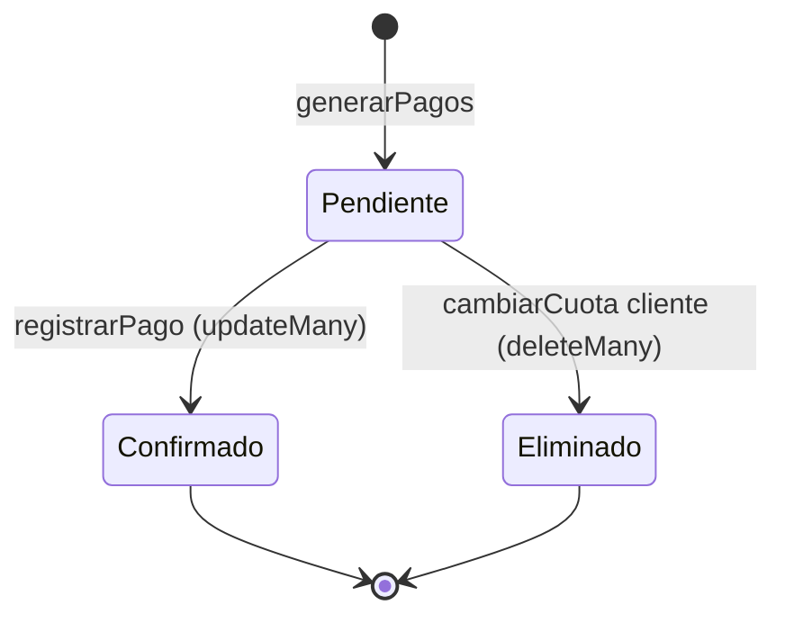

Sistema de cuotas + generación automática de pagos mensuales + confirmación por grupo + stats. Importes siempre en céntimos.

Controllers: `pagosController.js` y `cuotaController.js`. Modelos: [Pago](./modelos.md#pagos) y [TipoCuota](./modelos.md#tipos_cuota).

## Conceptos

### Tipo de cuota

Catálogo de productos del gimnasio. Define `nombre`, `meses`, `importe` (total, no por mes).

Ejemplo: `Trimestral` con `meses: 3, importe: 11000` → 110 € por 3 meses.

### Pago

Una fila por (cliente, mes). Cuota trimestral → **3 filas** compartiendo `grupo_pago`. El cliente paga una vez, el sistema mantiene una fila por mes para precisión en stats mensuales y "Cubierto hasta".

### Grupo de pago

`ObjectId` que une las N filas generadas juntas. Permite:
- Confirmar el lote completo (`updateMany({ grupo_pago }, { pendiente: false, fecha, registrado_por })`).
- Eliminar el lote completo (anular generación errónea).

<a id="generacion"></a>

## Generación mensual

`POST /api/pagos/generar` y `POST /api/pagos/generar-cron`. Misma lógica, autorización distinta.



### Reparto exacto de céntimos

Para una cuota `meses: 3, importe: 11000`:

| Mes | Base (`floor`) | Resto añadido | Importe final |
|-----|----------------|----------------|----------------|
| 1 | `floor(11000/3) = 3666` | — | 3666 |
| 2 | 3666 | — | 3666 |
| 3 (último) | 3666 | `11000 - 3666*3 = 2` | 3668 |

Suma: `3666 + 3666 + 3668 = 11000` ✓ (= 110 €). Sin pérdida de céntimos.

> ⚠️ **Comparar ObjectIds por string**
>
> En `generarPagos`, `pagosExistentes.map(id => id.toString())` antes de meter al Set, y `cliente._id.toString()` al buscar. Dos `ObjectId` que representan el mismo id en memoria son objetos distintos — `===` falla.

## Estados de un pago



- **Pendiente** → tras `generar`. `pendiente: true`, sin `fecha`, sin `registrado_por`.
- **Confirmado** → tras `registrarPago` por grupo. `pendiente: false`, con `fecha` y `registrado_por`.
- **Eliminado** → si el cliente cambia de cuota, los pendientes se borran (`deleteMany({ cliente_id, pendiente: true })`) para regenerar.

Los pagos confirmados **nunca** se borran en flujo normal.

## Confirmación por grupo

`POST /api/pagos/registrar` con `{ grupo_pago }`. Confirma todas las filas del grupo a la vez:

```js
await Pagos.updateMany(
  { grupo_pago },
  { pendiente: false, fecha: new Date(), registrado_por: req.usuario.id }
);
```

> 💡 **Por qué grupo y no fila**
>
> Una cuota trimestral son 3 filas (3 meses) que se cobran en un solo pago real. Confirmar fila a fila desincronizaría las stats y rompería "Cubierto hasta".

## Estadísticas

Las funciones de stats viven también en `pagosController.js`. Montadas en `statsRoutes.js`. Detalle: [Endpoints → Stats](./endpoints/stats.md).

### Trampas comunes en `aggregate`

- **Array vacío**: `aggregate` devuelve `[]` si no hay datos. Comprobar `resultado.length > 0` antes de `resultado[0].total`.
- **`$sum: '$importe'`**: trabaja con céntimos. El frontend formatea con `formatearImporte`.
- **`$sort: { mes: -1 }`**: funciona lex porque `YYYY-MM`.

### Último pago por cliente (mapa)

`GET /api/stats/ultimo-pago` devuelve mapa `{ clienteId: { pendiente, mes, grupo_pago, tipo_cuota } }`.

Implementación:

```
$match: { mes: { $lte: mesActual } }   // ignorar meses futuros de cuotas multimensuales
$sort:  { mes: -1 }
$group: { _id: '$cliente_id', pendiente: $first, mes: $first, grupo_pago: $first, tipo_cuota: $first }
```

El frontend lo convierte a objeto para acceso O(1) desde la tabla.

## "Cubierto hasta" — frontend

El cliente ve "Cubierto hasta: DD/MM/YYYY" calculado en `ClienteDashboard.jsx`:

1. `mesesPagados = pagos.filter(pago => !pago.pendiente).map(pago => pago.mes)`.
2. `mesVencimiento = mesesPagados.sort().at(-1)` (lex, el más reciente).
3. `calcularUltimoDia(mes)` → `new Date(anio, m, 0)`. **Truco:** día 0 del mes siguiente = último día del mes indicado. `new Date(2026, 5, 0)` → 31/5/2026.

Cuota trimestral pagada en abril → cubierto hasta `30/6/2026`.

## Estado de pago del mes (badge)

```js
const pagosMesActual = pagos.filter(p => p.mes === mesActual);
const pagoMesActual  = pagosMesActual.find(p => !p.pendiente) ?? pagosMesActual[0];
const estadoPago = pagoMesActual
  ? (pagoMesActual.pendiente ? 'pendiente' : 'confirmado')
  : 'no-generado';
```

El `find(!pendiente) ?? [0]` prioriza el confirmado en caso de múltiples pagos del mismo mes (edge case: cambio de cuota a mitad de mes).

## Gotchas

| Gotcha | Causa | Solución |
|--------|-------|---------|
| Suma ≠ total al repartir | Float | `Math.floor` + último mes con resto |
| `aggregate` peta | Array vacío | `if (resultado.length > 0)` |
| `mes` ordena mal | Cambio a Date | Mantener string `YYYY-MM` |
| Pago huérfano tras borrar cuota | `tipo_cuota` ObjectId | Es String (nombre). Ver [ADR-009](../arquitectura/decisiones.md#tipo-cuota-string) |
| Cron rechazado | Header `x-cron-secret` mal | Verificar valor en cron-job.org |
| `ModalGestionCuotas` guarda decimales | Falta conversión | `eurosACentimos` antes de POST/PUT |
| Reactivación con antigüedad vieja | `darDeAlta` no resetea | Sí lo hace — resetea `fecha_alta`. Intencional |
