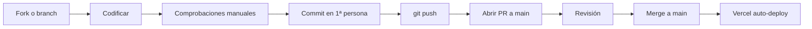

GymSuite es un proyecto académico individual. Esta guía resume el flujo si alguna vez se abre a colaboradores.

## Pre-requisitos

1. Setup local funcionando ([Setup local](./setup-local.md)).
2. Leer [Estilo de código](./estilo-codigo.md), [Git workflow](./git-workflow.md) y [Decisiones](../arquitectura/decisiones.md).
3. Acceso de escritura al repo (o fork).

## Flujo



## Antes de abrir PR

- [ ] Tu rama parte de `main` actualizado: `git checkout main && git pull && git checkout -b feature/x`.
- [ ] Sigues [Estilo de código](./estilo-codigo.md).
- [ ] Sigues [Git workflow](./git-workflow.md) — commits en español, 1ª persona singular.
- [ ] El proyecto **arranca** en local sin errores.
- [ ] Probaste el flujo afectado en el navegador.
- [ ] No hay `console.log` de debug, secretos ni archivos generados.
- [ ] Si tocas auth / pagos / mediciones: leíste el doc correspondiente.

## Anatomía del PR

### Título

Idéntico al primer commit. En español, 1ª persona singular, descriptivo.

### Descripción

```markdown
## Qué cambia
- Cambio 1
- Cambio 2

## Por qué
Contexto / motivación.

## Cómo lo probé
- Login admin → ...
- Crear cliente → ...

## Notas
- Algo a revisar especialmente.
- Decisión que tomé y por qué.
```

### Tamaño

PRs pequeños y enfocados — mejor 3 PRs de 100 líneas que 1 de 800.

## Revisión

Revisor comprueba:

1. **Funciona** — pull la rama y probar localmente.
2. **Sigue las convenciones** ([Estilo](./estilo-codigo.md)).
3. **No rompe nada** — flujos relacionados siguen OK.
4. **Decisiones de arquitectura respetadas** — si la PR contradice un [ADR](../arquitectura/decisiones.md), discutir.

### Cambios pedidos

Si revisor pide cambios:

1. Aplicar correcciones.
2. **Commit nuevo** (no rebase / squash interactivo) — facilita ver qué cambió respecto a la revisión.
3. Notificar.

### Merge

Una vez aprobada:

```bash
# Local
git checkout main
git pull
git merge feature/x --no-ff   # mantener trazabilidad
git push
```

`--no-ff` crea un merge commit, facilita ver el grupo de cambios en el log.

## Reportar bugs

Abrir issue en GitHub con:

```markdown
## Síntoma
Qué pasa.

## Esperado
Qué debería pasar.

## Reproducir
1. ...
2. ...

## Entorno
- Backend en: local / Vercel preview / Vercel prod
- Frontend en: localhost / preview / prod
- Navegador: Chrome 130
- OS: Windows 11
```

## Proponer cambios grandes

Antes de codificar:

1. Abrir issue describiendo la propuesta.
2. Esperar discusión (con el dueño del repo o equipo).
3. Si se aprueba, abrir PR.

Evita el caso "PR enorme rechazado por dirección" — discutir antes ahorra trabajo.

## Áreas con mayor sensibilidad

| Área | Cuidado especial |
|------|------------------|
| `authController.js` | Cambios pueden romper sesiones de todos |
| `pagosController.js` reparto | Bug = pérdida de céntimos |
| Validadores DNI/teléfono | [Mockeados intencionalmente](../arquitectura/decisiones.md#mocking-dni) |
| `bcrypt` version | [No tocar a 6.0.0](../seguridad/bcrypt.md) |
| Cookies prod | `sameSite` y `secure` deben coincidir al setear y al clear |

## Lecturas relacionadas

- [Setup local](./setup-local.md)
- [Estilo de código](./estilo-codigo.md)
- [Git workflow](./git-workflow.md)
- [Testing](./testing.md)
