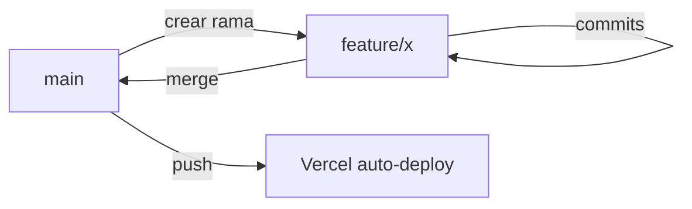

Convenciones de commits y flujo de trabajo Git para GymSuite. **Proyecto académico individual** — flujo simple, sin gitflow ni revisiones formales.

## Convención de commits

### Idioma

**Español.**

### Forma verbal

**Primera persona del singular**: `Implemento`, `Añado`, `Corrijo`, `Extraigo`, `Migro`. Combinar varios verbos con coma o `y`.

### Estructura

Una sola línea descriptiva. **Sin tipo** (`feat:`, `fix:`) ni cuerpo. Combinar varios cambios relacionados en un único mensaje.

```
<verbo en 1ª persona> <qué cambia> [, <verbo> <más cambios>] [y <último cambio>]
```

### Tono

Directo, qué cambia. Mencionar los componentes/archivos clave cuando aporte.

### Ejemplos reales del proyecto

```
Implemento dashboard de cliente, extraigo ModalConfirmarPago y añado modo soloLectura a modales

Extraigo helpers de medición a utils, añado StepperFecha y navegación cronológica entre mediciones en el modal completo

Añadir autenticación 2FA, refresh tokens, contraseñas temporales y reseteo de contraseña por admin

Corrijo bug por la refactorizacion
```

### Anti-patrones

```
✗ feat: add 2FA           ← inglés + conventional commits
✗ Fix bug                 ← demasiado genérico
✗ wip                     ← no descriptivo
✗ Update files            ← qué archivos? qué cambia?
✗ Implementé el dashboard ← pasado en lugar de presente
```

### Ejemplos buenos vs malos

| ❌ Mal | ✅ Bien |
|--------|---------|
| `Update auth` | `Añado validación de tab en login y verificarPropioOAdmin para entrenadores` |
| `Fix bug` | `Corrijo verCliente que devolvía 200 con cliente nulo` |
| `Tests` | `Añado test de validarImporte y validarFecha` |
| `Refactor` | `Extraigo helpers de medición a utils, añado StepperFecha` |

## Estrategia de ramas

Flujo simple:

| Rama | Función |
|------|---------|
| `main` | Estable. Vercel auto-deploy a prod |
| feature branches | Trabajo en curso. Mergear a main cuando esté listo |

No hay `develop`, `release` ni `hotfix` — proyecto individual no lo necesita.

## Flujo típico



```bash
# Empezar
git checkout main
git pull
git checkout -b feature/dashboard-cliente

# Trabajar
# ... cambios ...
git add .
git commit -m "Implemento card de mediciones con deltas en ClienteDashboard"

# Más cambios relacionados → un solo commit
git add .
git commit -m "Añado cálculo de mesVencimiento y badge de estado de pago"

# Subir
git push -u origin feature/dashboard-cliente

# Merge a main
git checkout main
git merge feature/dashboard-cliente
git push
```

## Frecuencia de commits

**Un commit por unidad lógica**, no por archivo.

- ✅ "Añado endpoint cambiar-cuota con eliminación de pagos pendientes" — endpoint + cambio en el cliente + actualización del modal = 1 commit.
- ❌ 1 commit por cada archivo del cambio = ruido.

## Antes de mergear a main

Checklist mental:

- [ ] El proyecto arranca sin errores.
- [ ] Probaste el flujo afectado en navegador.
- [ ] No hay `console.log` de debug.
- [ ] No hay `DISABLE_2FA=true` colado en código.
- [ ] No hay secretos commiteados (.env está en `.gitignore`).

## Archivos prohibidos

| Archivo | Razón |
|---------|-------|
| `.env` (cualquier nivel) | Secretos |
| `node_modules/` | Reproducible con `npm install` |
| `*.log` | Ruido |
| `.DS_Store`, `Thumbs.db` | SO específico |

`.gitignore` debe cubrirlos.

## Commit firmados (opcional)

Si tienes GPG configurado:

```bash
git config commit.gpgsign true
git config user.signingkey <KEY_ID>
```

No obligatorio para este proyecto.

## Tags / releases

Tag por hito académico:

```bash
git tag -a v0.1-entrega-parcial -m "Estado al cierre de la entrega parcial"
git push --tags
```

Útil para volver a ese punto sin perder el historial.

## Vercel y branches

| Branch | Comportamiento Vercel |
|--------|------------------------|
| `main` | Deploy a producción |
| Otras | Preview deployment con URL única (`gymsuite-git-<branch>-<usuario>.vercel.app`) |

Cada PR tiene su preview deployment. Útil para probar antes de mergear.

## Lecturas relacionadas

- [Estilo de código](./estilo-codigo.md)
- [Despliegue](../operaciones/despliegue.md)
- [Contribuir](./contribuir.md)
