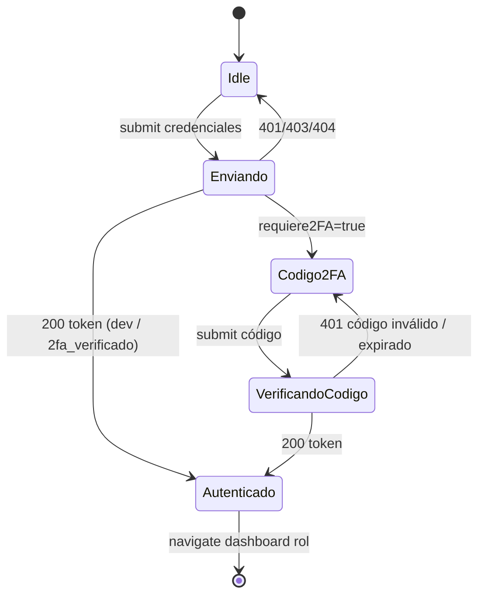

`pages/LoginPage.jsx`. Pantalla de login con pestañas Cliente/Trabajador y modal de verificación 2FA si está activa.

## Estados

| Estado | Tipo | Función |
|--------|------|---------|
| `tab` | `'cliente'` \| `'trabajador'` | Pestaña activa |
| `correo`, `contrasena` | string | Inputs |
| `error`, `cargando` | string / boolean | Feedback del form principal |
| `correoOTP` | `string \| null` | `null` por defecto; al recibir `requiere2FA: true` guarda el email y abre `Modal2FA` |
| `error2FA`, `cargando2FA` | — | Estado del modal |

## Máquina de estados

## Funciones

| Función | Acción |
|---------|--------|
| `handleCambiarTab(nuevaTab)` | Cambia pestaña, limpia errores |
| `handleSubmit(e)` | `POST /api/auth/login`. Si `requiere2FA`, abre modal. Si trae token, `completarLogin` |
| `handleVerificar2FA(codigo)` | `POST /api/auth/verificar-2fa`. Si OK, `completarLogin` |
| `handleCerrarModal()` | Cierra modal sin completar (reintento) |
| `completarLogin(token)` | Decodifica JWT, valida `rolEsValido(payload.rol, tab)`, `login(...)` del contexto, `navigate(RUTAS_ROL[rol])` |
| `rolEsValido(rol, tab)` | `tab === 'cliente'` ↔ `rol === 'cliente'`; `tab === 'trabajador'` ↔ `rol === 'admin' \| 'entrenador'` |

## Componentes montados

| Componente | Cuándo |
|------------|--------|
| `Header` | Siempre (sin usuario → solo título "GymSuite") |
| `CardLogin` | Siempre (pestañas + formulario) |
| `Modal2FA` | Solo si `correoOTP !== null` |

## Defensa en profundidad

El backend valida `tab` vs `rol` antes de generar OTP (no manda email si no encaja). El frontend re-valida en `completarLogin` decodificando el JWT. **Backend es la fuente de verdad**; el frontend duplica para no exponer datos prematuramente.

## Lecturas relacionadas

- [Backend → Auth flujo](../../backend/auth-flujo.md)
- [Backend → Endpoints Auth](../../backend/endpoints/auth.md)
- [Seguridad → 2FA](../../seguridad/2fa.md)
