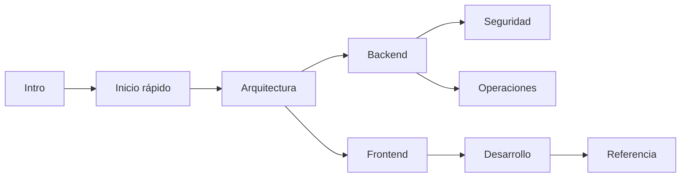

GymSuite es una aplicación web para gimnasios que centraliza la gestión de **clientes, mediciones antropométricas y cuotas mensuales**. Proyecto intermodular DAW de Ismael Monjas Llorente.

## Stack en una línea

React + Tailwind (Vite) ↔ Express (Node 20) ↔ MongoDB Atlas. JWT 15m + refresh 7d (cookie httpOnly) + 2FA por email. Desplegado en Vercel como dos proyectos separados.

## Roles

| Rol | Qué puede hacer |
|-----|-----------------|
| **Admin** | Gestionar entrenadores, admins, clientes, cuotas y ver estadísticas del negocio |
| **Entrenador** | Gestionar clientes (datos, mediciones, pagos) |
| **Cliente** | Consultar su perfil, mediciones y pagos |

## Cómo navegar esta documentación

La doc está organizada según el [framework Diátaxis](https://diataxis.fr/) — separa por intención del lector:

- **¿Quieres aprender desde cero?** Empieza por [Inicio rápido](./inicio-rapido.md) o [Setup local](./desarrollo/setup-local.md).
- **¿Quieres resolver una tarea concreta?** Las guías how-to viven en [Despliegue](./operaciones/despliegue.md) y [Git workflow](./desarrollo/git-workflow.md).
- **¿Necesitas consultar un endpoint, modelo o variable?** Todo en [Endpoints](./backend/endpoints/overview.md), [Modelos](./backend/modelos.md) y [Variables de entorno](./operaciones/variables-entorno.md).
- **¿Quieres entender una decisión o flujo?** [Arquitectura](./arquitectura/vision-general.md) y [Modelo de amenazas](./seguridad/modelo-amenazas.md).

## Mapa rápido

> ℹ️ **Estado del proyecto**
>
> Proyecto académico activo. Sin tests automatizados todavía (ver [Testing](./desarrollo/testing.md)). Documentación canónica viva en este sitio.

## Decisiones críticas a recordar

1. **`bcrypt@^5.1.1`** — la versión `6.0.0` no existe en npm y rompe Vercel.
2. **Importes en céntimos** — todos los importes (`TipoCuota.importe`, `Pago.importe`) se almacenan como enteros en céntimos.
3. **ES modules en backend** — `import`/`export`; instanciar dependencias que leen env vars dentro de la función.
4. **Validadores DNI/teléfono mockeados** — divisor `% 19` y prefijo `5` en lugar del oficial.

Detalle: [Decisiones de arquitectura](./arquitectura/decisiones.md).
