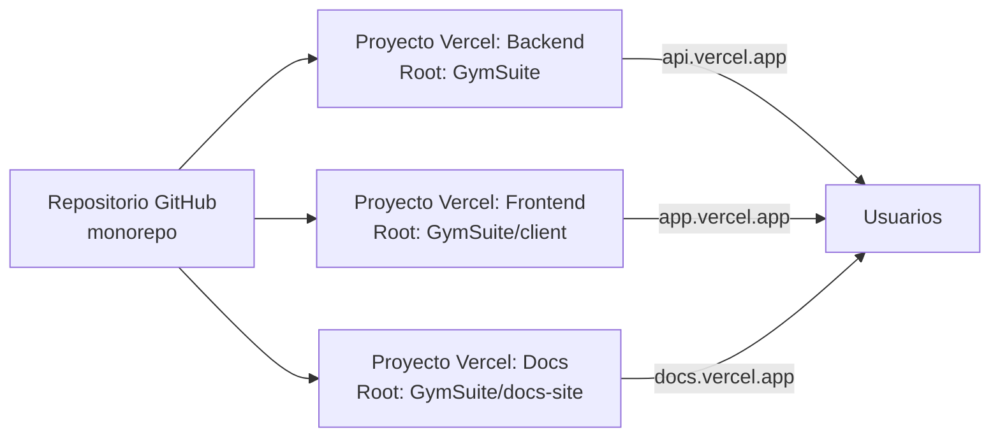

Frontend y backend se despliegan como **dos proyectos separados en Vercel**. La generación automática de pagos usa cron externo (cron-job.org).

## Vista general



## Backend

### Configuración Vercel

| Campo | Valor |
|-------|-------|
| **Root Directory** | `GymSuite` |
| **Entry point** | `server/api/index.js` (auto-detectado por patrón `/api/*`) |
| **Config** | `vercel.json` en raíz del repo |
| **Build** | `npm install` (sin build step — Node ESM) |

### Variables de entorno (Vercel → Settings → Environment Variables)

| Variable | Obligatoria | Notas |
|----------|:-----------:|-------|
| `MONGODB_URI` | ✅ | URI Atlas |
| `MONGODB_URI_BACKUP` | recomendada | URI respaldo. `conectarDB` la prueba si falla la principal |
| `JWT_SECRET` | ✅ | 32+ chars aleatorios |
| `JWT_REFRESH_SECRET` | ✅ | **Distinto** de `JWT_SECRET` |
| `CRON_SECRET` | ✅ | Header `x-cron-secret` para cron-job.org |
| `FRONTEND_URL` | ✅ | URL exacta del frontend (CORS) |
| `EMAIL_USER` | ✅ | Gmail con 2FA activo |
| `EMAIL_PASS` | ✅ | App password (16 chars, sin espacios). Generar en https://myaccount.google.com/apppasswords |
| `NODE_ENV` | ✅ | `production`. Activa `sameSite=none, secure=true` |
| `DISABLE_2FA` | no | **NO setear en prod** |
| `PORT` | no | Ignorado en serverless |

Detalle completo: [Variables de entorno](./variables-entorno.md).

### Pasos

1. Crear proyecto Vercel desde el repo.
2. **Root Directory:** `GymSuite`.
3. Añadir variables de entorno.
4. Deploy.
5. Verificar `https://<backend>.vercel.app/api/health` → `{ "estado": "ok", "mongo": "conectado" }`.

## Frontend

### Configuración Vercel

| Campo | Valor |
|-------|-------|
| **Root Directory** | `GymSuite/client` |
| **Build command** | `npm run build` (Vite) |
| **Output directory** | `dist` |
| **Config** | `vercel.front.json` (raíz) + `client/vercel.json` (rewrite SPA) |

### Variables de entorno

| Variable | Obligatoria | Notas |
|----------|:-----------:|-------|
| `VITE_API_URL` | ✅ en prod | URL del backend (ej: `https://gymsuite-api.vercel.app`) |

### Rewrite SPA

`client/vercel.json` permite a React Router manejar las rutas:

```json title="client/vercel.json"
{ "rewrites": [{ "source": "/(.*)", "destination": "/" }] }
```

Sin esto, refrescar en `/admin` daría 404.

### Pasos

1. Crear proyecto Vercel separado.
2. **Root Directory:** `GymSuite/client`.
3. Añadir `VITE_API_URL` apuntando al backend ya desplegado.
4. Deploy.
5. Probar login completo.

## Docs site

| Campo | Valor |
|-------|-------|
| **Root Directory** | `GymSuite/docs-site` |
| **Build command** | `npm run build` |
| **Output directory** | `build` |

Sin variables de entorno necesarias.

## CORS — gotcha clásico

`server/api/index.js`:

```js
const origenesPermitidos = process.env.FRONTEND_URL ? [process.env.FRONTEND_URL] : true;
app.use(cors({ origin: origenesPermitidos, credentials: true }));
```

| Entorno | `FRONTEND_URL` | Origen permitido |
|---------|----------------|------------------|
| Prod | setado | Solo ese dominio (restrictivo) |
| Dev | sin setar | `true` = cualquier origen (útil LAN) |

`credentials: true` **obligatorio** para que las cookies viajen.

> 🚨 **CORS abierto con credentials**
>
> `origin: '*'` + `credentials: true` está **prohibido** por el navegador. En prod siempre dominio específico.

## Conexión Mongo con fallback

`server/config/db.js`:

```js
const conectarDB = async () => {
  try { await mongoose.connect(MONGODB_URI); }
  catch {
    try { await mongoose.connect(MONGODB_URI_BACKUP); }
    catch { process.exit(1); }
  }
};
```

Si ambas URIs fallan, el proceso termina. En Vercel = 500 hasta que la conexión vuelva.

`/api/health` devuelve `readyState === 1` = OK, otros = 503.

## Atlas IP whitelist

Vercel = IPs dinámicas → en Atlas usar **`0.0.0.0/0`** o configurar Private Link.

## Vercel function timeout

Plan gratuito: **10s** por function. Si `generarPagos` excede con muchos clientes, monitorizar y paginar.

## Checklist pre-deploy

- [ ] `NODE_ENV=production` en backend.
- [ ] `FRONTEND_URL` apunta al dominio correcto.
- [ ] `VITE_API_URL` apunta al backend correcto.
- [ ] `DISABLE_2FA` **no setado** o `'false'`.
- [ ] `JWT_SECRET` y `JWT_REFRESH_SECRET` distintos + 32+ chars.
- [ ] `CRON_SECRET` igual en Vercel y cron-job.org.
- [ ] App password Gmail válida.
- [ ] Cookies en DevTools con `Secure: true, SameSite: None`.
- [ ] Login completo (con 2FA por email) funciona end-to-end.
- [ ] `/api/health` responde OK.
- [ ] Cron-job.org configurado y probado.

## Endpoints utilitarios

| Ruta | Función |
|------|---------|
| `GET /api/health` | Estado server + Mongo readyState |
| `GET /api/docs/spec` | JSON OpenAPI |
| `GET /api/docs` | Swagger UI (dark mode con filter CSS) |

## Lecturas relacionadas

- [Variables de entorno](./variables-entorno.md)
- [Cron de pagos](./cron-pagos.md)
- [Backup MongoDB](./backup-mongo.md)
- [Seguridad → Cookies](../seguridad/cookies.md)
