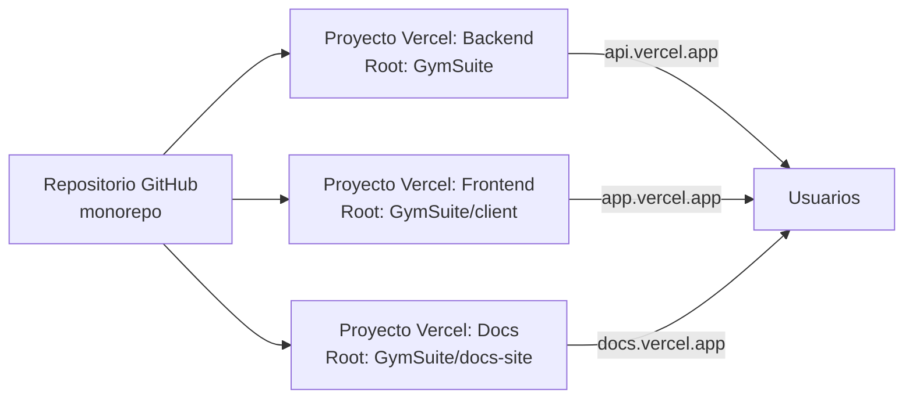

Frontend y backend se despliegan como **dos proyectos separados en Vercel**. La generación automática de pagos usa cron externo (cron-job.org).

## Vista general



## Backend

### Configuración Vercel

| Campo | Valor |
|-------|-------|
| **Root Directory** | `GymSuite` |
| **Entry point** | `server/api/index.js` (auto-detectado por patrón `/api/*`) |
| **Config** | `vercel.json` en raíz del repo |
| **Build** | `npm install` (sin build step — Node ESM) |

### Variables de entorno (Vercel → Settings → Environment Variables)

| Variable | Obligatoria | Notas |
|----------|:-----------:|-------|
| `MONGODB_URI` | ✅ | URI Atlas |
| `MONGODB_URI_BACKUP` | recomendada | URI respaldo. `conectarDB` la prueba si falla la principal |
| `JWT_SECRET` | ✅ | 32+ chars aleatorios |
| `JWT_REFRESH_SECRET` | ✅ | **Distinto** de `JWT_SECRET` |
| `CRON_SECRET` | ✅ | Header `x-cron-secret` para cron-job.org |
| `FRONTEND_URL` | ✅ | URL exacta del frontend (CORS) |
| `EMAIL_USER` | ✅ | Gmail con 2FA activo |
| `EMAIL_PASS` | ✅ | App password (16 chars, sin espacios). Generar en https://myaccount.google.com/apppasswords |
| `NODE_ENV` | ✅ | `production`. Activa `sameSite=none, secure=true` |
| `DISABLE_2FA` | no | **NO setear en prod** |
| `PORT` | no | Ignorado en serverless |

Detalle completo: [Variables de entorno](./variables-entorno.md).

### Pasos

1. Crear proyecto Vercel desde el repo.
2. **Root Directory:** `GymSuite`.
3. Añadir variables de entorno.
4. Deploy.
5. Verificar `https://<backend>.vercel.app/api/health` → `{ "estado": "ok", "mongo": "conectado" }`.

## Frontend

### Configuración Vercel

| Campo | Valor |
|-------|-------|
| **Root Directory** | `GymSuite/client` |
| **Build command** | `npm run build` (Vite) |
| **Output directory** | `dist` |
| **Config** | `vercel.front.json` (raíz) + `client/vercel.json` (rewrite SPA) |

### Variables de entorno

| Variable | Obligatoria | Notas |
|----------|:-----------:|-------|
| `VITE_API_URL` | ✅ en prod | URL del backend (ej: `https://gymsuite-api.vercel.app`) |

### Rewrite SPA

`client/vercel.json` permite a React Router manejar las rutas:

```json title="client/vercel.json"
{ "rewrites": [{ "source": "/(.*)", "destination": "/" }] }
```

Sin esto, refrescar en `/admin` daría 404.

### Pasos

1. Crear proyecto Vercel separado.
2. **Root Directory:** `GymSuite/client`.
3. Añadir `VITE_API_URL` apuntando al backend ya desplegado.
4. Deploy.
5. Probar login completo.

## Docs site

| Campo | Valor |
|-------|-------|
| **Root Directory** | `GymSuite/docs-site` |
| **Build command** | `npm run build` |
| **Output directory** | `build` |

Sin variables de entorno necesarias.

## CORS — fail-closed

`server/api/index.js`:

```js
const frontendUrl = process.env.FRONTEND_URL;
if (process.env.NODE_ENV === 'production' && !frontendUrl) {
  throw new Error('FRONTEND_URL es obligatoria en producción');
}
const origenesPermitidos = frontendUrl
  ? [frontendUrl]
  : ['http://localhost:5173', 'http://localhost:3000'];
app.use(cors({ origin: origenesPermitidos, credentials: true }));
```

| Entorno | `FRONTEND_URL` | Origen permitido |
|---------|----------------|------------------|
| Prod | setado | Solo ese dominio (restrictivo) |
| Prod | sin setar | La función aborta en cold start con `Error: FRONTEND_URL es obligatoria en producción` |
| Dev | setado | Solo ese dominio |
| Dev | sin setar | Solo `http://localhost:5173` y `http://localhost:3000` |

`credentials: true` **obligatorio** para que las cookies viajen.

:::danger CORS abierto con credentials
`origin: '*'` o `origin: true` reflejando cualquier origen junto a `credentials: true` permitiría a un sitio malicioso adjuntar las cookies de sesión del usuario en peticiones cross-site. El navegador prohíbe `'*' + credentials`, pero `origin: true` (reflejo del header `Origin` recibido) sí pasa. Por eso el bloque actual nunca usa `true` y la prod aborta si la env var no llega.
:::

## Conexión Mongo con fallback

`server/config/db.js`:

```js
const conectarDB = async () => {
  try { await mongoose.connect(MONGODB_URI); }
  catch {
    try { await mongoose.connect(MONGODB_URI_BACKUP); }
    catch { process.exit(1); }
  }
};
```

Si ambas URIs fallan, el proceso termina. En Vercel = 500 hasta que la conexión vuelva.

`/api/health` devuelve `readyState === 1` = OK, otros = 503.

## Atlas IP whitelist

Vercel = IPs dinámicas → en Atlas usar **`0.0.0.0/0`** o configurar Private Link.

## Vercel function timeout

Plan gratuito: **10s** por function. Si `generarPagos` excede con muchos clientes, monitorizar y paginar.

## Sanitización — `express-mongo-sanitize`

`mongoSanitize({ replaceWith: '_' })` se aplica en `server/api/index.js` justo tras `express.json()`. Reemplaza `$` y `.` en todas las keys de `req.body`, `req.query` y `req.params` por `_`.

Protege contra dos vectores a la vez:

- **NoSQL injection:** impide que operadores Mongo (`$ne`, `$gt`, `$where`…) lleguen a las consultas.
- **Prototype pollution:** impide keys como `__proto__` o `constructor` que podrían contaminar el prototipo de Object.

:::note
Mongoose schema-strict ya rechaza campos no declarados, pero `mongoSanitize` añade una capa antes de que el body llegue a los controllers.
:::

## Swagger UI

`/api/docs` y `/api/docs/spec` solo se registran cuando `NODE_ENV !== 'production'`. En producción esas rutas no existen → 404. Esto evita exponer la superficie de la API a un atacante.

En desarrollo, Swagger UI carga sus assets desde `unpkg.com/swagger-ui-dist@5.32.4` con atributos `integrity` (SRI sha384) y `crossorigin="anonymous"`.

## Headers de seguridad — `helmet`

`helmet` se aplica en `server/api/index.js` antes de CORS y rutas. Añade automáticamente:

| Header | Efecto |
|--------|--------|
| `Strict-Transport-Security` | Fuerza HTTPS (`max-age=31536000; includeSubDomains`) |
| `X-Content-Type-Options: nosniff` | Evita MIME sniffing |
| `X-Frame-Options: DENY` | Evita clickjacking (vía `frameAncestors: ["'none'"]`) |
| `Referrer-Policy: no-referrer` | No filtra la URL de origen en peticiones cross-origin |
| `Content-Security-Policy` | prod: solo `'self'`; dev: abre `https://unpkg.com` para Swagger |

La CSP varía según entorno. En producción el `scriptSrc` y `styleSrc` se restringen a `'self'` porque Swagger no existe. En desarrollo se abre `https://unpkg.com` para los assets de Swagger UI (fijados con SRI).

## Manejo de errores del servidor

Los controllers capturan excepciones en `try/catch`. El comportamiento del `catch`:

1. `console.error('[error]', error)` — conserva el stack en los logs del servidor (visibles en Vercel → Functions → Logs).
2. Respuesta al cliente: en `NODE_ENV=production` devuelve `"Error en el servidor"` sin detalle; en dev devuelve `error.message` para facilitar el debug.

`server/api/index.js` registra un middleware centralizado de error como red de seguridad para cualquier excepción no capturada por los controllers:

```js
app.use((err, _req, res, _next) => {
    console.error('[error no capturado]', err);
    res.status(err.status ?? 500).json({
        mensaje: process.env.NODE_ENV === 'production' ? 'Error en el servidor' : err.message,
    });
});
```

:::tip
En Vercel, los `console.error` aparecen en el panel **Functions → Logs** del proyecto backend.
:::

## Auditoría de dependencias — CI

`.github/workflows/audit.yml` ejecuta `npm audit --audit-level=high` en cada PR a `main` y los lunes 08:00 UTC:

```yaml title=".github/workflows/audit.yml"
jobs:
  audit-server:
    runs-on: ubuntu-latest
    steps:
      - uses: actions/checkout@v4
      - uses: actions/setup-node@v4
        with: { node-version: 20 }
      - run: npm ci
        working-directory: GymSuite/server
      - run: npm audit --audit-level=high
        working-directory: GymSuite/server
```

`server/package.json` incluye `"overrides": { "tar": "^7.4.3" }` para forzar una versión segura de `tar`, que llegaba como dependencia transitiva de `bcrypt → @mapbox/node-pre-gyp` (solo usada en install, no en runtime).

## Rate limiting en serverless

`express-rate-limit` está configurado con store en memoria (default). En Vercel cada función arranca su propio proceso en cold start y los contadores **no se comparten entre invocaciones**:

- Frena ráfagas contra una misma instancia caliente.
- No bloquea brute force distribuido entre varios cold starts ni entre varias regiones.

Para garantía completa contra distribuido, mover el store a Redis con [`rate-limit-redis`](https://www.npmjs.com/package/rate-limit-redis) (Upstash tiene tier gratis compatible con Vercel) y exponer la URL en una env var.

Configuración actual: [Auth flujo § Rate limiting](../backend/auth-flujo.md#rate-limiting).

## Checklist pre-deploy

- [ ] `NODE_ENV=production` en backend.
- [ ] `FRONTEND_URL` apunta al dominio correcto.
- [ ] `VITE_API_URL` apunta al backend correcto.
- [ ] `DISABLE_2FA` **no setado** o `'false'`.
- [ ] `JWT_SECRET` y `JWT_REFRESH_SECRET` distintos + 32+ chars.
- [ ] `CRON_SECRET` igual en Vercel y cron-job.org.
- [ ] App password Gmail válida.
- [ ] Cookies en DevTools con `Secure: true, SameSite: None`.
- [ ] Login completo (con 2FA por email) funciona end-to-end.
- [ ] `/api/health` responde OK.
- [ ] Cron-job.org configurado y probado.

## Endpoints utilitarios

| Ruta | Disponible | Función |
|------|:----------:|---------|
| `GET /api/health` | Siempre | Estado server + Mongo readyState |
| `GET /api/docs/spec` | Solo dev | JSON OpenAPI |
| `GET /api/docs` | Solo dev | Swagger UI (dark mode con filter CSS) |

## Lecturas relacionadas

- [Variables de entorno](./variables-entorno.md)
- [Cron de pagos](./cron-pagos.md)
- [Backup MongoDB](./backup-mongo.md)
- [Seguridad → Cookies](../seguridad/cookies.md)
