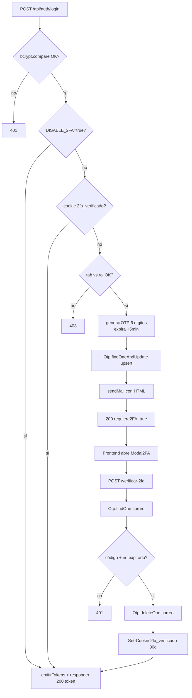

GymSuite implementa **2FA por email** con código OTP de 6 dígitos. Activo por defecto; se puede saltar en dev con `DISABLE_2FA=true` o en dispositivos de confianza (cookie `2fa_verificado`).

## Flujo



## Estructura del OTP

Colección `otps` (modelo `OtpModel.js`):

| Campo | Tipo | Notas |
|-------|------|-------|
| `correo` | String indexado | Único de hecho (upsert) |
| `codigo` | String | 6 dígitos con `crypto.randomInt(100000, 1000000)` (CSPRNG) |
| `expira` | Date | **Índice TTL**: Mongo borra al pasar el timestamp |

## Generación del código

```js
import { randomInt } from 'crypto';

function generarOTP() {
  return String(randomInt(100000, 1000000));  // 6 dígitos
}
```

> 🚨 **CSPRNG obligatorio**
>
> **Nunca** `Math.random()` para tokens / OTPs. Usar `crypto.randomInt` (CSPRNG) — no predecible.

## Upsert

```js
await Otp.findOneAndUpdate(
  { correo },
  { codigo, expira: new Date(Date.now() + 5 * 60 * 1000) },
  { upsert: true }
);
```

Sobrescribe cualquier OTP previo del mismo correo. No acumula.

## Verificación

```js
const entrada = await Otp.findOne({ correo });
if (!entrada) return res.status(401).json({ mensaje: 'No hay código pendiente' });
if (Date.now() > entrada.expira.getTime()) {
  await Otp.deleteOne({ correo });
  return res.status(401).json({ mensaje: 'Código expirado' });
}
if (entrada.codigo !== codigo) {
  return res.status(401).json({ mensaje: 'Código incorrecto' });
}
await Otp.deleteOne({ correo });  // evitar reuso
```

> 💡 **Doble verificación de expiración**
>
> El índice TTL puede tardar **segundos** en limpiar. `verificar2FA` también compara `Date.now() > entrada.expira` por seguridad.

## How-to: desactivar 2FA en desarrollo

Setear en `.env`:

```env
DISABLE_2FA=true
```

`login` comprueba `process.env.DISABLE_2FA === 'true'` y emite token directo sin OTP.

> ⚠️ **Nunca en prod**
>
> `DISABLE_2FA=true` en prod **rompe el segundo factor**. Verificar antes de cada despliegue:
>
> ```bash
> vercel env ls
> ```
>
> No debe aparecer `DISABLE_2FA` o debe valer `'false'`.

## How-to: invalidar la confianza del dispositivo

La cookie `2fa_verificado` da 30 días sin OTP en ese navegador. Para invalidarla:

1. **El usuario**: limpiar cookies del dominio en DevTools.
2. **Tú (backend)**: añadir `res.clearCookie('2fa_verificado', cookieOpciones)` en `logout`. **No implementado** actualmente — el logout solo borra `refresh_token`. Considera implementarlo si el flujo lo necesita.

## Envío del email — `mailer.js`

```js title="server/utils/mailer.js"
export const sendMail = async ({ to, subject, html }) => {
  // El transporter se crea DENTRO de la función
  const transporter = nodemailer.createTransport({
    service: 'gmail',
    auth: {
      user: process.env.EMAIL_USER,
      pass: process.env.EMAIL_PASS,   // contraseña de aplicación, no la del Gmail
    },
  });
  await transporter.sendMail({
    from: `"GymSuite" <${process.env.EMAIL_USER}>`,
    to, subject, html,
  });
};
```

> ⚠️ **Transporter dentro de la función**
>
> **No** instanciar el `transporter` a nivel de módulo: los `import` de ES modules se evalúan antes que `dotenv.config()`, así que `EMAIL_USER` sería `undefined`. Detalle: [ADR-003](../arquitectura/decisiones.md#esm).

### `EMAIL_PASS` debe ser contraseña de aplicación

No la contraseña real de la cuenta Gmail. Generar en https://myaccount.google.com/apppasswords (requiere 2FA activado en la cuenta Google).

## Por qué OTP en Mongo y no en memoria

Vercel es **serverless**: cada invocación arranca una función nueva. No hay memoria compartida entre invocaciones — guardar el OTP en memoria significaría que cada request a `verificar-2fa` no encuentra el OTP del `login`. Mongo + TTL resuelve esto.

## Gotchas

- **OTP borrado tras verificar**: si la respuesta de `verificar-2fa` falla en tránsito, el usuario debe repetir login (y se le manda nuevo OTP). Aceptado.
- **Cliente en lista negra de Gmail**: si Gmail clasifica los emails como spam, el usuario no los recibe. Verificar SPF/DKIM o usar un servicio dedicado (SendGrid, Mailgun) para prod real.
- **Email no llega**: revisar carpeta spam, `EMAIL_PASS` (app password Gmail, 16 chars sin espacios), 2FA activado en la cuenta Google.

## Lecturas relacionadas

- [Backend → Auth flujo](../backend/auth-flujo.md)
- [Backend → Endpoints Auth](../backend/endpoints/auth.md#post-apiauthverificar-2fa)
- [Frontend → Login 2FA](../frontend/vistas/login-2fa.md)
- [Operaciones → Variables de entorno](../operaciones/variables-entorno.md)
