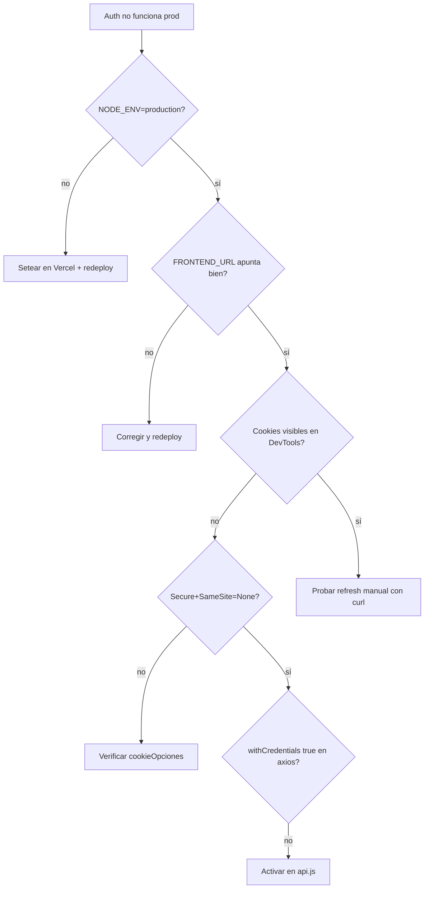

Tres cookies en juego. Las del backend cambian de política según `NODE_ENV`.

## Tabla canónica

| Cookie | Set por | HttpOnly | SameSite (prod) | SameSite (dev) | Secure (prod) | Secure (dev) | Vida |
|--------|---------|:--------:|:----------------:|:---------------:|:-------------:|:------------:|------|
| `token` | Frontend (`AuthContext`) | ❌ | `Strict` | `Strict` | (auto en HTTPS) | — | 2 h |
| `refresh_token` | Backend (`authController`) | ✅ | `none` | `strict` | ✅ | ❌ | 7 d |
| `2fa_verificado` | Backend (`verificar2FA`) | ✅ | `none` | `strict` | ✅ | ❌ | 7 d |

## Por qué `SameSite=none` en prod

Frontend y backend viven en **dominios distintos** de Vercel (`gymsuite.vercel.app` vs `gymsuite-api.vercel.app`).

- `Strict` o `Lax`: el navegador **no enviaría** las cookies en peticiones cross-site → refresh y 2FA romperían.
- `none`: el navegador las envía siempre, pero **exige** `Secure: true` (HTTPS obligatorio).

## Por qué `Strict` en `token` (frontend)

La cookie `token` la setea el frontend con `SameSite=Strict` porque **solo el frontend la usa**: la lee de `document.cookie` para inyectarla como header `Authorization: Bearer`. Nunca viaja cross-site automáticamente — el navegador la incluye solo cuando el JS la pone en un header.

## Cómo se setea cada una

### `token` (frontend)

```js title="client/src/context/AuthContext.jsx"
document.cookie = `token=${jwt}; path=/; max-age=${2*60*60}; SameSite=Strict`;
```

### `refresh_token` (backend)

```js title="server/controllers/authController.js"
const cookieOpciones = {
  httpOnly: true,
  sameSite: NODE_ENV === 'production' ? 'none' : 'strict',
  secure: NODE_ENV === 'production',
  maxAge: 7 * 24 * 60 * 60 * 1000,
};
res.cookie('refresh_token', refreshJwt, cookieOpciones);
```

### `2fa_verificado` (backend, en `verificar2FA`)

```js
const valor = firmar2FA(usuario._id.toString(), req.headers['user-agent']);
res.cookie('2fa_verificado', valor, {
  httpOnly: true,
  sameSite: NODE_ENV === 'production' ? 'none' : 'strict',
  secure: NODE_ENV === 'production',
  maxAge: 7 * 24 * 60 * 60 * 1000,
});
```

**Formato del valor:** `<usuarioId>.<uaHash16>.<firma32>`

- `usuarioId` — `_id` del usuario en hex.
- `uaHash16` — primeros 16 hex de `sha256(User-Agent)`.
- `firma32` — primeros 32 hex de `HMAC-SHA256(JWT_REFRESH_SECRET, "<usuarioId>.<uaHash16>")`.

`login` valida la cookie con `verificar2FACookie` recalculando la firma esperada y comparando con `crypto.timingSafeEqual`. Si la UA cambia (cookie copiada a otro navegador) o el cuerpo se altera, las firmas no cuadran y se descarta — el usuario pasa al flujo OTP normal.

## Cómo se borra

### `token`

```js title="client/src/context/AuthContext.jsx"
document.cookie = 'token=; path=/; max-age=0';
```

### `refresh_token` y `2fa_verificado`

```js title="server/controllers/authController.js"
const opcionesBase = { httpOnly: true, sameSite, secure };
res.clearCookie('refresh_token', opcionesBase);   // MISMA config que al setear
res.clearCookie('2fa_verificado', opcionesBase);  // logout borra ambas
```

> 🚨 **Opciones del clear DEBEN coincidir**
>
> Si en prod usaste `sameSite: 'none', secure: true` al setear, debes usar **las mismas opciones** al borrar. El navegador identifica las cookies por (nombre, path, domain, sameSite, secure) — si no coincide, no la borra.

## `withCredentials: true` en axios

Obligatorio para que el navegador adjunte cookies en peticiones cross-origin. Ya configurado en `client/src/services/api.js`:

```js
const api = axios.create({ baseURL: BASE_URL, withCredentials: true });
```

## Configurar CORS para credentials

En backend (`server/api/index.js`):

```js
app.use(cors({
  origin: process.env.FRONTEND_URL ?? true,
  credentials: true,
}));
```

`origin: '*'` con `credentials: true` está **prohibido** por el navegador. Debe ser un origen específico (o array de orígenes).

## Diagnóstico en prod

Si auth falla en prod pero funciona en dev:



**Pasos concretos:**
1. Verificar `NODE_ENV === 'production'` en variables de Vercel.
2. `FRONTEND_URL` apunta al dominio exacto del frontend.
3. `withCredentials: true` en axios (ya está en `api.js`).
4. DevTools → Application → Cookies del dominio del backend: ¿se ven `refresh_token` y `2fa_verificado` con `Secure: true` y `SameSite: None`?

## Lecturas relacionadas

- [Tokens JWT y refresh](./tokens.md)
- [Backend → Auth flujo](../backend/auth-flujo.md)
- [Operaciones → Despliegue](../operaciones/despliegue.md) (sección CORS)
- [Decisiones → Cookies con dos políticas](../arquitectura/decisiones.md#cookies-politica)
