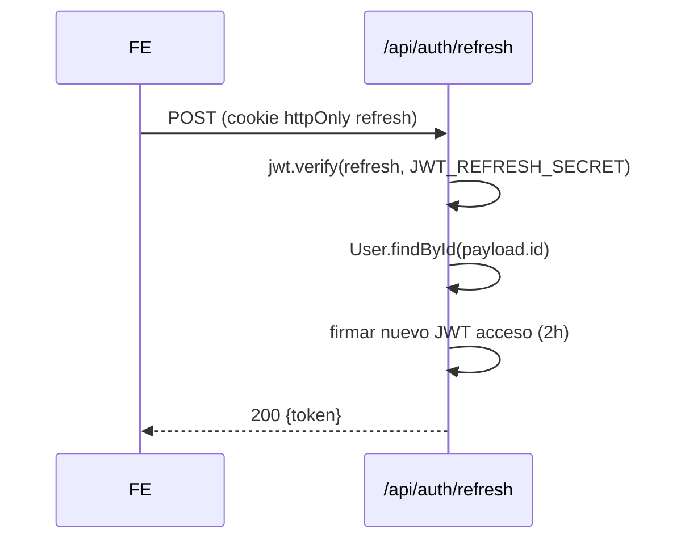

GymSuite usa dos tokens distintos: **JWT de acceso** (corto, en cookie JS-accesible) y **refresh token** (largo, en cookie httpOnly).

## Resumen

| Token | Algoritmo | Secret | Vida | Dónde se guarda | Quién lo emite | Quién lo lee |
|-------|-----------|--------|------|------------------|----------------|---------------|
| **JWT acceso** | HS256 | `JWT_SECRET` | 2 h | Cookie `token` (no httpOnly) | Backend en `emitirTokens` | Frontend (lo inyecta como header `Authorization: Bearer`) |
| **Refresh** | HS256 | `JWT_REFRESH_SECRET` | 7 d | Cookie `refresh_token` (httpOnly) | Backend en `emitirTokens` | Backend en `POST /api/auth/refresh` |

## Payload del JWT de acceso

```json
{
  "id": "6630a1b2c3d4e5f6a7b8c9d0",
  "rol": "admin",
  "nombre": "Ada",
  "apellidos": "Lovelace",
  "forzar_cambio_password": false,
  "iat": 1715688000,
  "exp": 1715695200
}
```

El frontend decodifica este payload (sin verificar firma — el backend lo hace en cada request) para alimentar `useAuth().usuario`.

## Payload del refresh

```json
{
  "id": "6630a1b2c3d4e5f6a7b8c9d0",
  "iat": 1715688000,
  "exp": 1716292800
}
```

Solo `id`. No incluye rol — el backend lo lee de Mongo al refrescar (`User.findById(payload.id)`).

## Secretos

| Variable | Función | Generación |
|----------|---------|------------|
| `JWT_SECRET` | Firmar JWT acceso | `crypto.randomBytes(32).toString('hex')` — mínimo 32 chars |
| `JWT_REFRESH_SECRET` | Firmar refresh | Igual. **Distinto** al de acceso |

> 🚨 **Distintos entre sí**
>
> Si `JWT_SECRET === JWT_REFRESH_SECRET`, un atacante con un refresh expirado podría forjar un JWT acceso válido. Siempre **distintos**.

## Renovación



**Importante**: el refresh **no rota**. La cookie sigue viva hasta su expiración natural. Trade-off de simplicidad vs seguridad — ver [ADR-007](../arquitectura/decisiones.md#jwt-js).

## Almacenamiento

### Cookie `token` (JWT acceso) — JS-accesible

```js
document.cookie = `token=${jwt}; path=/; max-age=${2*60*60}; SameSite=Strict`;
```

| Atributo | Valor | Razón |
|----------|-------|-------|
| `path=/` | toda la app | — |
| `max-age=7200` | 2 h | Alineado con `exp` del JWT |
| `SameSite=Strict` | — | El frontend lo usa solo en peticiones same-origin (header `Authorization`) |
| `httpOnly` | **NO** | El frontend debe leerlo desde JS para inyectarlo en headers |
| `secure` | — | No setado por el frontend (lo añade el navegador automático en HTTPS) |

### Cookie `refresh_token` — httpOnly

Setada por el backend con `cookieOpciones`:

```js
{
  httpOnly: true,
  sameSite: NODE_ENV === 'production' ? 'none' : 'strict',
  secure: NODE_ENV === 'production',
  maxAge: 7 * 24 * 60 * 60 * 1000,  // 7 días
}
```

Inaccesible desde JS. El navegador la envía automáticamente con cada petición a `/api/auth/refresh` gracias a `withCredentials: true` en axios.

## Rotación de secretos

Para rotar `JWT_SECRET` o `JWT_REFRESH_SECRET` en prod:

1. Generar nuevo valor.
2. Actualizar en Vercel.
3. Redespliegue: todas las cookies activas quedan inválidas → todos los usuarios deben reloguear.

Si quieres rotación sin downtime: implementar lista de secretos válidos (uno actual + uno previo) y consultar ambos durante una ventana. **No implementado** actualmente.

## Pruebas manuales

### Verificar firma JWT en local

```bash
# decodificar payload sin verificar
node -e "console.log(JSON.parse(Buffer.from(process.argv[1].split('.')[1], 'base64').toString()))" <jwt>

# verificar firma con secret
node -e "console.log(require('jsonwebtoken').verify('<jwt>', process.env.JWT_SECRET))"
```

### Forzar expiración

Editar `emitirTokens` para usar `expiresIn: '5s'`, hacer login, esperar 5s, hacer petición → debería disparar el refresh automático.

## Lecturas relacionadas

- [Cookies](./cookies.md)
- [Backend → Auth flujo](../backend/auth-flujo.md)
- [Decisiones → JWT accesible por JS](../arquitectura/decisiones.md#jwt-js)
